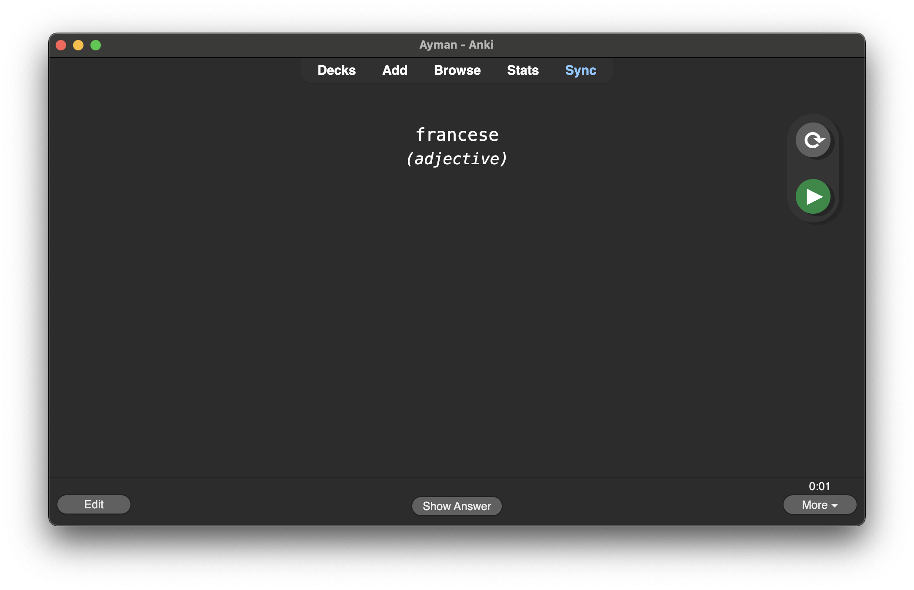
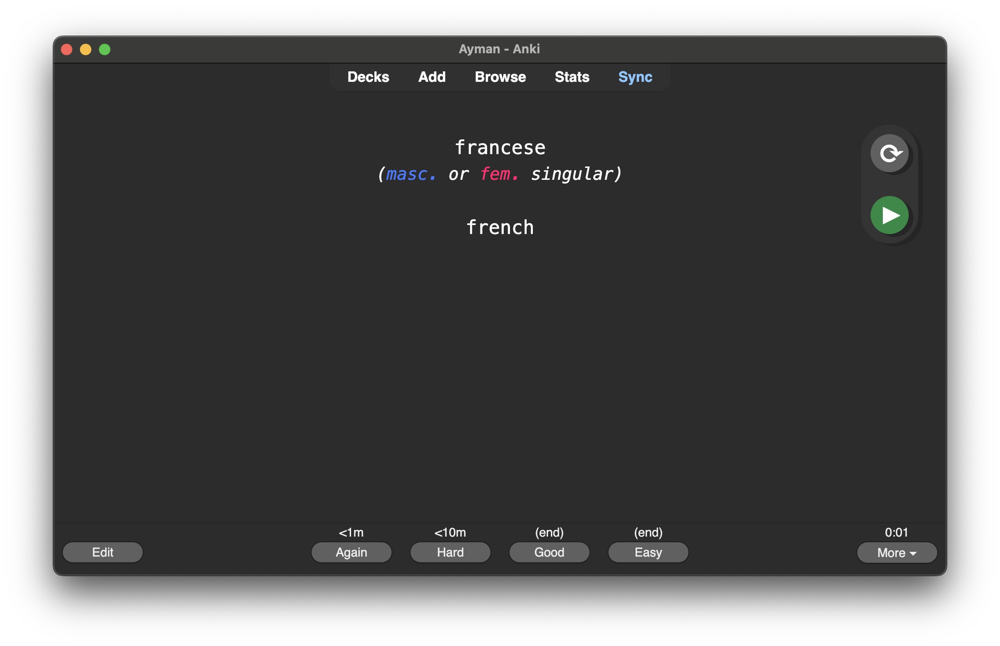
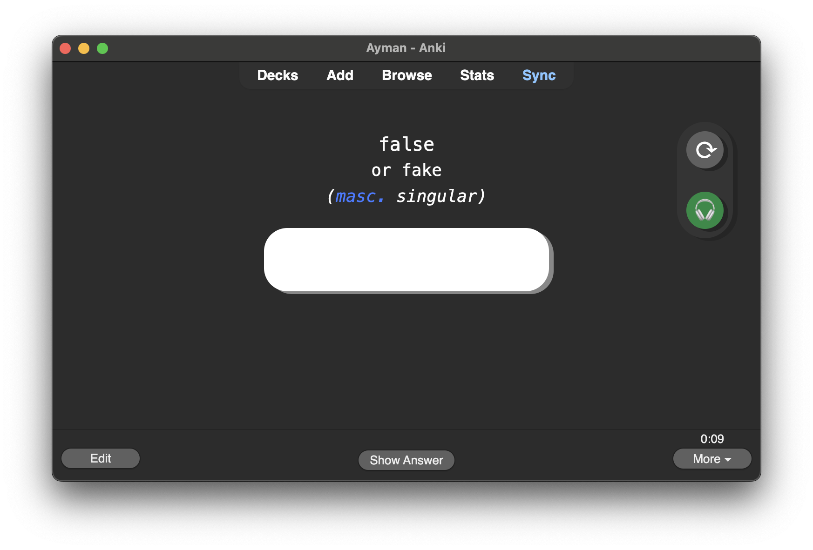
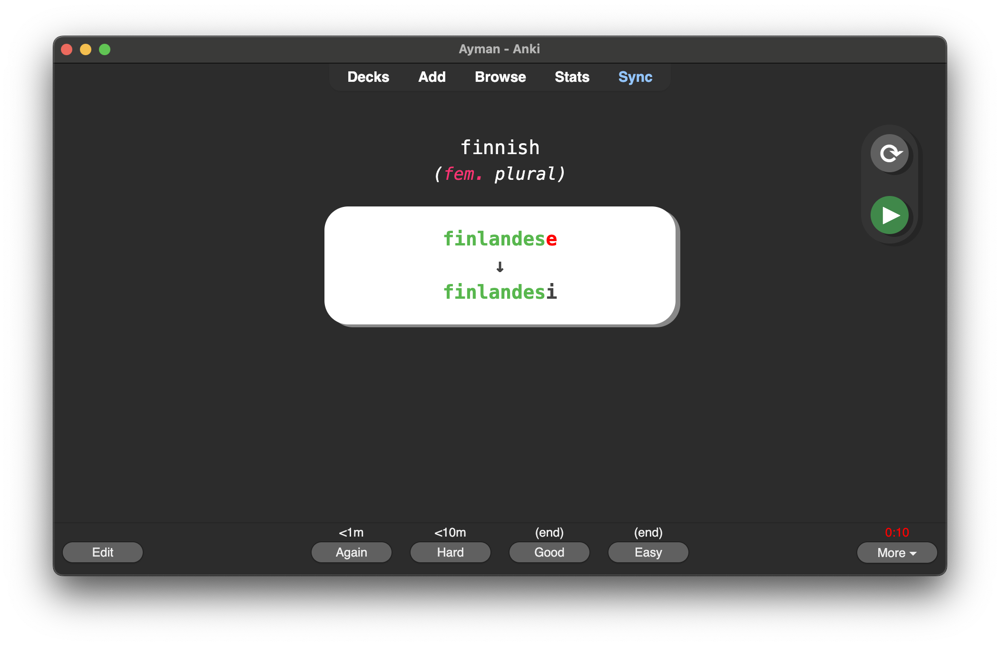

# Language Learning Anki Note Type

A versatile and feature-rich note type designed for language learners, leveraging the power of Anki to enhance vocabulary acquisition, pronunciation practice, and grammar understanding.

## Table of Contents

1. [Overview](#overview)
2. [Fields](#fields)
    - [Mandatory Fields](#mandatory-fields)
    - [Optional Fields](#optional-fields)
3. [Card Types](#card-types)
    - [Language -> Native](#language--native)
    - [Native -> Language](#native--language)
4. [Key Features](#key-features)
    - [Typing and Feedback](#typing-and-feedback)
    - [Dynamic Hints](#dynamic-hints)
    - [Dynamic Classification](#dynamic-classification)
    - [Audio and Phonology](#audio-and-phonology)
    - [Images and Synonyms](#images-and-synonyms)
5. [Examples](#examples)
6. [Installation](#installation)
7. [Contributing](#contributing)

---

## Overview

This note type is optimized for language learners studying multiple languages simultaneously. It includes customizable fields, supports multiple card types, and integrates interactive features to provide a comprehensive learning experience.

---

## Fields

### Mandatory Fields

- **Native**: The word or phrase in the learner's native language.
- **Language-1**: The word or phrase in the first target language.

### Optional Fields

- **Language-2** and **Language-3**:  
    Add additional target languages to generate more card pairs.
- **Classification**:  
    Dynamically renders grammatical details on the front and back of cards.
- **Synonyms**:  
    Displays alternative translations or meanings alongside the native word.
- **Phonology-1, Phonology-2, Phonology-3**:  
    Store pronunciations for each target language.
- **Audio-1, Audio-2, Audio-3**:  
    Embed audio files for pronunciation practice.
- **Image**:  
    Add a visual representation to aid memorization.

---

## Card Types

### Language -> Native

Cards are generated from each **Language-x** field paired with the **Native** field. For example:

- **Language-1 -> Native**
- **Language-2 -> Native**
- **Language-3 -> Native**

### Native -> Language

These cards reverse the direction of recall, prompting learners with the **Native** field and requiring input for the corresponding **Language-x**.

- **Native -> Language-1**
- **Native -> Language-2**
- **Native -> Language-3**

---

## Key Features

### Typing and Feedback

- **Interactive Input**:  
    For **Native -> Language** cards, users type their response directly.
- **Feedback Highlights**:  
    The system highlights incorrect letters in red and correct letters in green.

---

### Dynamic Hints

Hints are automatically generated for **Native -> Language** cards when additional language fields are populated. The system displays the shortest unique string from the corresponding **Language-x** field.

[IMAGE OF (HINT BUTTON AND GENERATED HINT ON CARD)]

---

### Dynamic Classification

The **Classification** field adapts to the card type and context, displaying grammar-specific details:

- Front: General category (e.g., noun, adjective).
- Back: Detailed attributes (e.g., gender, number).

**Example Styling**:

- masc.
- fem.

[IMAGE OF (CLASSIFICATION FIELD FRONT AND BACK STYLING EXAMPLE)]

---

### Audio and Phonology

- **Audio Playback**:  
    Audio files stored in **Audio-x** fields are accessible during review.
- **Phonetic Transcription**:  
    Pronunciations in **Phonology-x** fields display on the same side as the **Native** field.

[IMAGE OF (AUDIO PLAYBACK ICON AND PHONOLOGY FIELD DISPLAY)]

---

### Images and Synonyms

- Images added via the **Image** field appear alongside the **Native** field.
- Synonyms are listed under the **Native** word for alternative meanings.

[IMAGE OF (IMAGE AND SYNONYM DISPLAY ON CARD)]

---

## Examples

### Example Card: Native -> Language-1

**Native**: appearance  
**Language-1**: apparenza, la  
**Language-2**: aspetto, il  
**Classification**: noun

[IMAGE OF (FRONT AND BACK OF NATIVE -> LANGUAGE-1 CARD WITH TYPING FEEDBACK)]

---

## Installation

1. Download the note type file from this repository.
2. Open Anki and import the file.
3. Add new notes using the template and populate the fields as described.

